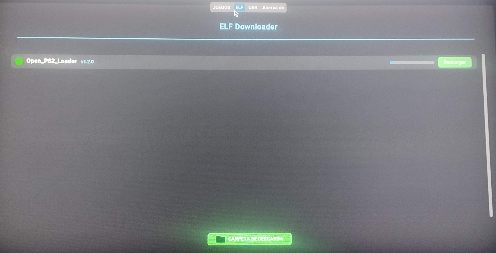
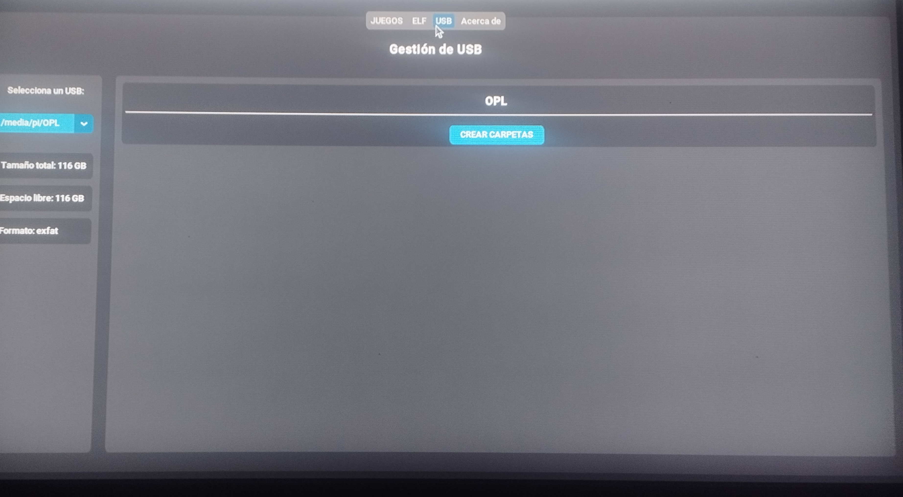

# PS2 Game Downloader 🎮

[](https://www.python.org/)


**PS2 Game Downloader** es una aplicación moderna para descargar y gestionar juegos y ELFs para PlayStation 2.  
Su interfaz intuitiva basada en **CustomTkinter** permite manejar descargas, unidades USB y mantener todo organizado para usarlo con OPL (Open PS2 Loader).

> ⚠️ **Nota:** La aplicación sigue en desarrollo, por lo que algunas funciones pueden cambiar en futuras versiones. Puedes usarla como base para tus propios proyectos.

---

## 🎯 Características principales

- **Descarga de juegos PS2**:
  - Filtrado por nombre y categoría.
  - Iconos de juego y estado de enlace.
  - Barra de progreso con velocidad y tiempo estimado.
  - Control de pausa, reanudación y cancelación.

- **Descarga de archivos ELF**:
  - Lista de ELFs desde GitHub con versión y estado del enlace.
  - Descarga individual con barra de progreso.
  - Selección de carpeta de descarga.

- **Gestión de USB**:
  - Detección automática de unidades USB.
  - Información de tamaño, espacio libre y formato.
  - Creación automática de carpetas CD y DVD para OPL.

- **Sección “Acerca de”**:
  - Información del proyecto y equipo.
  - Enlaces a GitHub, Facebook y página web.
  - Animación decorativa de derechos de autor.

---

## 🖼 Capturas de pantalla

### Pestaña Juegos


### Pestaña ELF


### Pestaña USB


### Pestaña Acerca de


> Nota: Coloca tus capturas en `GUI/Images/screenshots/` y ajusta los nombres si cambian.

---

## ⚙ Requisitos

- Python 3.10 o superior  
- [CustomTkinter](https://github.com/TomSchimansky/CustomTkinter)  
- Pillow  
- psutil

---

## ⚙ Instalación y ejecución

1. Instalar dependencias con:

```bash
pip install customtkinter pillow psutil
```

2. Clona el repositorio

```bash
git clone https://github.com/tu_usuario/ps2-game-downloader.git
cd ps2-game-downloader
```

3. Ejecutar aplicacion

```bash
python main.py
```
---

## ⚙ Archivos ini propios

Para usar tus propios juegos y ELFs, debes configurar los archivos ini:

- juegos.ini: abre GUI/juegos_tab.py y edita la línea 134 con el enlace RAW de tu juegos.ini.
- elf.ini: abre GUI/elf_downloader_tab.py y edita la línea 65 con el enlace RAW de tu elf.ini.

> ⚠️ **Nota:** Asegúrate de que los enlaces sean RAW de GitHub, GitLab o cualquier host que permita lectura directa.
> Modifica los archivos ini según tus propios juegos y ELFs. 


---


## ⚙ Licencia

- Uso libre. No requiere licencia. Puedes usar, modificar y distribuir el código sin restricciones.

  


